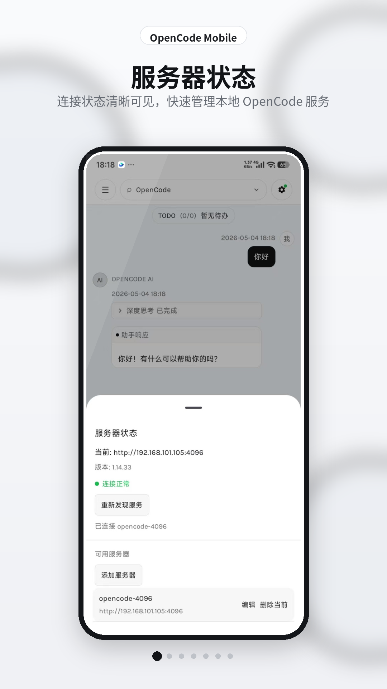
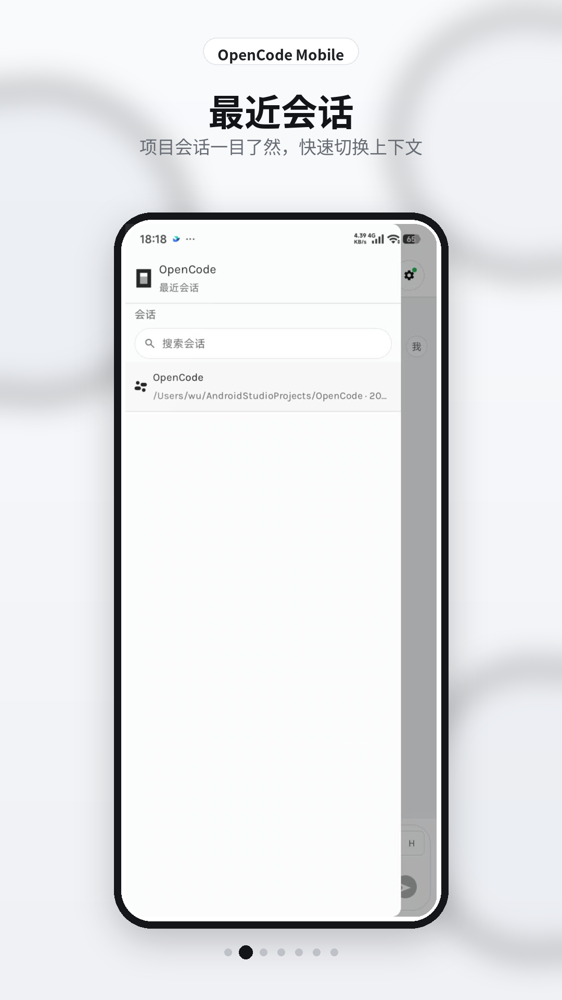
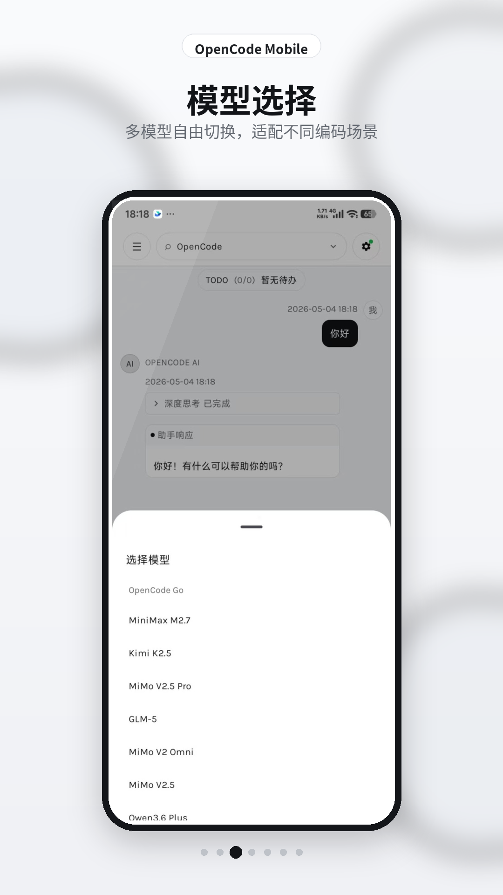
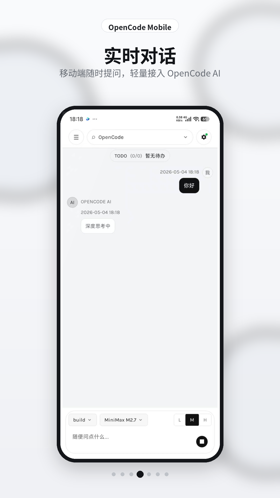
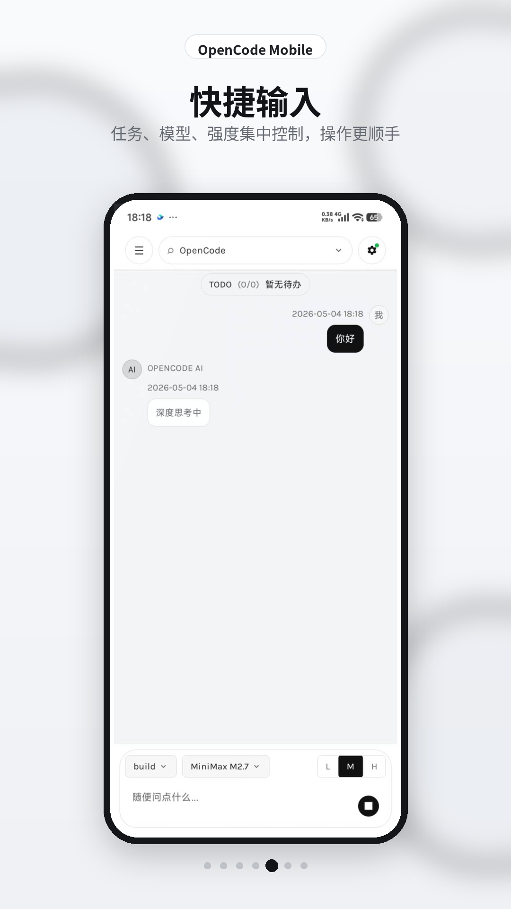
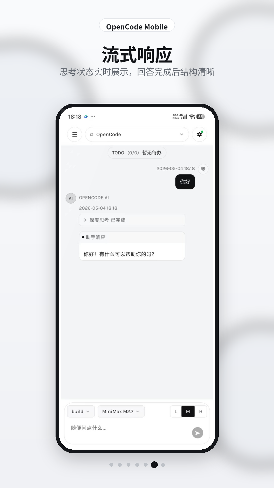
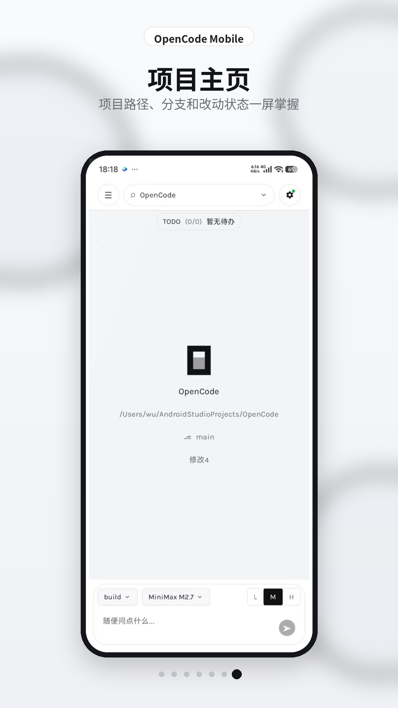

# OpenCode Android Client

OpenCode Android Client 是一个基于 Jetpack Compose 的 OpenCode 移动端示例，
用于连接局域网内的 OpenCode Server，选择项目并进行会话。

## 快速开始

1. 使用最新稳定版 Android Studio 打开项目。
2. 在你的开发机启动 OpenCode Server（示例）：
   - `opencode serve --hostname 0.0.0.0 --port 4096 --mdns`
3. 保证手机与服务端在同一局域网，启动 App 后会通过 mDNS 自动发现服务。

## 核心能力

- mDNS 自动发现 `_opencode._tcp.` 服务
- OpenCode 会话与项目选择
- Build / Plan 模式切换
- 模型与思考等级选择
- 流式消息展示与状态管理
- Material 3 主题与 OpenCode 风格设计令牌

## 主要模块

- `opencode/discovery`：封装服务发现逻辑（`NsdManager`）
- `opencode/api`：OpenCode HTTP API 访问与 JSON 解析
- `opencode/model`：服务、会话、项目、消息等客户端模型
- `opencode/OpencodeViewModel`：发现、连接、会话与消息发送编排
- `conversation/OpenCodeConversation.kt`：OpenCode 聊天界面

## Screenshots

<p align="left">
  
  
  
  
  
  
  
</p>

## 测试

- 单元测试：`./gradlew :app:testDebugUnitTest`
- UI 测试：`./gradlew :app:connectedDebugAndroidTest`

关键测试目录：
- `app/src/test/java/com/github/go_kenka/opencode/opencode`
- `app/src/androidTest/java/com/github/go_kenka/opencode`

## 当前状态

项目仍在持续迭代中，部分功能可能尚未完全实现。

## License
```
Copyright 2020 The Android Open Source Project

Licensed under the Apache License, Version 2.0 (the "License");
you may not use this file except in compliance with the License.
You may obtain a copy of the License at

    https://www.apache.org/licenses/LICENSE-2.0

Unless required by applicable law or agreed to in writing, software
distributed under the License is distributed on an "AS IS" BASIS,
WITHOUT WARRANTIES OR CONDITIONS OF ANY KIND, either express or implied.
See the License for the specific language governing permissions and
limitations under the License.
```
